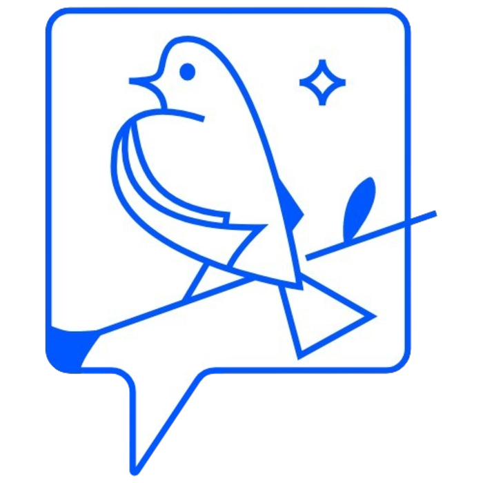

# Telware-Frontend

   
    <h1>Telware</h1>
    
Where messages take a flight

<!-- STATIC ANALYSIS BADGES -->

## ❓ About the Repo

This repo contains the UI of a chat application that imitates telegram in features and theme developed as a college project in CUFE

## 🚀 Quick start

Check our [deployed website](https://dev.telware.tech/)

- Emails to use:

  front1@gmail.com

  front2@gmail.com

  front3@gmail.com

  front4@gmail.com

  front5@gmail.com

- Password: 12345678

## 🧰 Tech Stack

 

    

## 🔥 Main Features

- Signup
- Login
  - with email & password
  - oauth login
- messaging:
  - Reply
  - Edit
  - Forward
  - Mention
  - Delete
  - Pin
  - Search
  - block/unblock users
- Groups and channels
  - Adding/removing members
  - chanage permissons
  - make others admins
  - Deleting group/channel
  - Edit channel privacy settings
- Voice Calls
- Admin Dashboard
- Add/Remove/view/delete Stories
- Edit profile settings
- Session Management

## 🤵 Contributers

|  |  |  |  |  |
| ------------------------------------------------------------------------------------------------- | ----------------------------------------------------------------------------------------- | ------------------------------------------------------------------------------------------- | ------------------------------------------------------------------------------------------- | ------------------------------------------------------------------------------------------- |
| [AbdelruhmanSamy](https://github.com/AbdelruhmanSamy/)                                            | [amir-kedis](https://github.com/amir-kedis/)                                              | [AhmedHamdiy](https://github.com/AhmedHamdiy)                                               | [Asmaa-204](https://github.com/Asmaa-204)                                                   | [sarah-kamall](https://github.com/sarah-kamall/)                                            |
